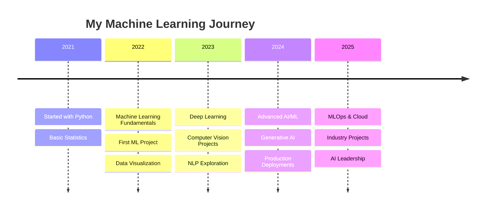

#  Hey there! I'm DarkoSIX

<div align="center">
  
  <!-- Enhanced Animated Banner with Particle Effect -->
  
  
  <!-- Enhanced Typing Animation with Multiple Lines -->
  
  
  <!-- Animated Counters with Glow Effect -->
  <p>
    
    
    
    
  </p>

  <!-- Enhanced Animated Divider -->
  
  
  <!-- Floating Elements Animation -->
  
  
  

</div>

---

##  About Me

<table>
<tr>
<td width="60%">

### 🚀 Who Am I?

- 🎓 **Fourth-year Data Science student** at **SLIIT**
- 💡 Passionate about **AI, Machine Learning & Data Analysis**
- 🌱 Currently learning: **Generative AI, NLP, Cloud Computing**
- 📍 Based in **Kandy, Sri Lanka** 🇱🇰
- 🎯 Goal: **Becoming a leading AI/ML Engineer**
- 📫 Reach me: **bandaranayakanimesh@gmail.com**
- ⚡ Fun fact: **I love exploring new technologies and building innovative solutions**

### 🌟 Current Status
```yaml
name: DarkoSIX
located_in: Kandy, Sri Lanka
current_job: Data Science Student
education: ["Bachelor's in Data Science", "AI/ML Specialization"]
company: SLIIT
fields_of_interests: ["Machine Learning", "Deep Learning", "Computer Vision", "NLP"]
technical_background: ["Python", "JavaScript", "React", "TensorFlow", "PyTorch"]
currently_learning: ["Generative AI", "MLOps", "Cloud Computing"]
hobbies: ["Coding", "Tech Exploration", "Innovation"]
```

</td>
<td width="40%">


<!-- Animated Skill Bars -->
<div align="center">
  
  <br>
  
  <br>
  
</div>

</td>
</tr>
</table>

<!-- Animated Separator -->


---

##  Tech Stack & Skills

<div align="center">

###  Programming Languages


###  Frameworks & Libraries  


###  Machine Learning & AI

<br/>


###  Cloud & DevOps

<br/>


###  Databases & Tools


</div>

<!-- Animated Tech Wave -->


---

##  Featured Projects

<div align="center">

<!-- Enhanced Project Cards with Hover Effects -->
<table>
<tr>
<td width="50%">
<div align="center">

<h3>🛒 E-Commerce Platform</h3>


<br><br>
<p><strong>🔥 MERN Stack | Full SDLC</strong></p>
<p>Complete e-commerce solution with modern UI/UX, payment integration, and real-time features</p>

</div>
</td>
<td width="50%">
<div align="center">

<h3>📊 BI Solution</h3>


<br><br>
<p><strong>📈 SSIS | SSAS | Power BI</strong></p>
<p>End-to-end business intelligence pipeline with automated ETL processes</p>

</div>
</td>
</tr>
<tr>
<td width="50%">
<div align="center">

<h3>🏥 AR Medical System</h3>


<br><br>
<p><strong>🥽 AR | Face Recognition | 3D</strong></p>
<p>Real-time AR with voice feedback system and medical data visualization</p>

</div>
</td>
<td width="50%">
<div align="center">

<h3>👁️ Object Detection</h3>


<br><br>
<p><strong>🎯 YOLOv8 | Computer Vision</strong></p>
<p>Live webcam object detection with real-time analytics dashboard</p>

</div>
</td>
</tr>
</table>

<!-- Project Stats -->
<div align="center">


</div>

</div>

<!-- Animated Divider -->


---

##  Machine Learning Expertise

<div align="center">

<!-- Enhanced ML Categories with Progress Indicators -->
<table>
<tr>
<td align="center" width="20%">

<br><strong>Supervised Learning</strong>
<br>📈 Regression, Classification
<br>🌲 Random Forest, SVM
<br>
</td>
<td align="center" width="20%">

<br><strong>Deep Learning</strong>
<br>🧠 CNNs, RNNs
<br>⚡ Neural Networks
<br>
</td>
<td align="center" width="20%">

<br><strong>Computer Vision</strong>
<br>👁️ Object Detection
<br>🖼️ Image Processing
<br>
</td>
<td align="center" width="20%">

<br><strong>NLP</strong>
<br>📝 Text Processing
<br>🤖 Language Models
<br>
</td>
<td align="center" width="20%">

<br><strong>MLOps</strong>
<br>🚀 Deployment
<br>📊 Monitoring
<br>
</td>
</tr>
</table>

<!-- ML Journey Timeline -->
### 🚀 My ML Journey



</div>

---

##  Certifications & Achievements

<div align="center">

<!-- Enhanced Achievement Display -->


<table>
<tr>
<td align="center" width="25%">

<br><strong>🌐 Google Cloud</strong>
<br>Generative AI Fundamentals
<br>
</td>
<td align="center" width="25%">

<br><strong>💼 Microsoft</strong>
<br>Power BI (PL-300)
<br>
</td>
<td align="center" width="25%">

<br><strong>☁️ AWS</strong>
<br>ML Foundations
<br>
</td>
<td align="center" width="25%">

<br><strong>🐍 Python</strong>
<br>Advanced Programming
<br>
</td>
</tr>
</table>

<!-- Achievement Stats -->


</div>

---

##  GitHub Analytics

<div align="center">

<!-- Enhanced Stats Layout -->
<table>
<tr>
<td width="50%">

</td>
<td width="50%">

</td>
</tr>
</table>

<!-- Enhanced Streak Stats -->


<!-- 3D Contribution Graph -->


<!-- Detailed GitHub Metrics -->
<table>
<tr>
<td align="center">

</td>
</tr>
<tr>
<td align="center">


</td>
</tr>
</table>

<!-- Animated Contribution Snake -->
<picture>
<source media="(prefers-color-scheme: dark)" srcset="https://raw.githubusercontent.com/DarkoSix-06/DarkoSix-06/output/github-contribution-grid-snake-dark.svg">
<source media="(prefers-color-scheme: light)" srcset="https://raw.githubusercontent.com/DarkoSix-06/DarkoSix-06/output/github-contribution-grid-snake.svg">

</picture>

</div>

---

##  Current Focus & Goals

<div align="center">

<!-- Enhanced Focus Areas -->
<table>
<tr>
<td align="center" width="25%">

<br><strong>🎯 Building AI Solutions</strong>
<br>Creating production-ready ML applications
<br>
</td>
<td align="center" width="25%">

<br><strong>🤖 Learning GenAI</strong>
<br>Exploring LLMs and Generative Models
<br>
</td>
<td align="center" width="25%">

<br><strong>🌟 Open Source</strong>
<br>Contributing to ML/AI projects
<br>
</td>
<td align="center" width="25%">

<br><strong>🚀 Career Growth</strong>
<br>Advancing in AI/ML Engineering
<br>
</td>
</tr>
</table>

### 📅 2025 Goals

```yaml
Q1_2025:
  - Complete Advanced ML Specialization
  - Launch 3 ML Projects
  - Contribute to 5 Open Source Projects

Q2_2025:
  - Industry Internship in AI/ML
  - Build Personal AI Assistant
  - Obtain AWS ML Certification

Q3_2025:
  - Graduate with Honors
  - Full-time AI/ML Engineer Role
  - Start Tech Blog/YouTube Channel

Q4_2025:
  - Lead ML Projects
  - Mentor Junior Developers
  - Speak at Tech Conferences
```

</div>

---

##  Let's Connect & Collaborate

<div align="center">

<!-- Enhanced Social Media Section -->
<table>
<tr>
<td align="center">

<br><strong>📧 Email</strong>
<br><a href="mailto:bandaranayakanimesh@gmail.com">

</a>
</td>
<td align="center">

<br><strong>💻 GitHub</strong>
<br><a href="https://github.com/DarkoSix-06">

</a>
</td>
<td align="center">

<br><strong>💼 LinkedIn</strong>
<br><a href="https://linkedin.com/in/your-profile">

</a>
</td>
<td align="center">

<br><strong>🐦 Twitter</strong>
<br><a href="https://twitter.com/your-handle">

</a>
</td>
</tr>
</table>

<!-- Contact Stats -->


<!-- Animated Contact Banner -->
<br><br>


<!-- Professional Network -->
<br>


</div>

---

##  Weekly Development Breakdown

<div align="center">

```text
Python         ████████████████████░░░░   80%
JavaScript     ████████████████░░░░░░░░   65%
Machine Learning ███████████████░░░░░░░   75%
Data Analysis  ██████████████████░░░░░░   85%
Web Development ███████████████░░░░░░░░   70%
Cloud Computing ██████████░░░░░░░░░░░░░   45%
```

<!-- Coding Activity -->


</div>

---

##  Recent Blog Posts & Articles

<div align="center">

<!-- Blog Feed -->
<table>
<tr>
<td width="50%">

<strong>🤖 "Building Your First ML Pipeline"</strong>
<br><small>A complete guide to creating production-ready ML pipelines</small>
<br>
</td>
<td width="50%">

<strong>👁️ "Computer Vision in Healthcare"</strong>
<br><small>Exploring AI applications in medical imaging</small>
<br>
</td>
</tr>
<tr>
<td width="50%">

<strong>🚀 "Deploying ML Models with FastAPI"</strong>
<br><small>Best practices for ML model deployment</small>
<br>
</td>
<td width="50%">

<strong>🌟 "The Future of Generative AI"</strong>
<br><small>Trends and predictions in GenAI landscape</small>
<br>
</td>
</tr>
</table>

</div>

---

##  Support My Work

<div align="center">

<!-- Enhanced Support Section -->


**✨ Enjoying my projects? Help me keep creating amazing content! ✨**

<table>
<tr>
<td align="center">

<br><strong>☕ Buy Me Coffee</strong>
<br><a href="https://www.buymeacoffee.com/darkosix">

</a>
</td>
<td align="center">

<br><strong>⭐ Star Repos</strong>
<br><a href="https://github.com/DarkoSix-06">

</a>
</td>
<td align="center">

<br><strong>🤝 Collaborate</strong>
<br><a href="mailto:bandaranayakanimesh@gmail.com">

</a>
</td>
</tr>
</table>

<!-- Support Stats -->


</div>

---

##  Fun Facts & Hobbies

<div align="center">

<table>
<tr>
<td width="50%">

### 🎯 Quick Facts About Me

- 🌙 **Night Owl**: Best coding happens after midnight
- ☕ **Coffee Addict**: 5+ cups daily (don't judge!)
- 🎵 **Music Lover**: Lo-fi beats while coding
- 📚 **Bookworm**: Sci-fi and tech books enthusiast
- 🎮 **Gamer**: Strategy games and puzzle solving
- 🏃‍♂️ **Fitness**: Morning runs to balance screen time
- 🌱 **Gardener**: Growing herbs and small plants
- 🍳 **Cooking**: Experimenting with Sri Lankan cuisine

</td>
<td width="50%">

### 🔮 Currently Exploring

- 🧠 **Quantum Computing** fundamentals
- 🌐 **Web3 & Blockchain** applications in AI
- 🎨 **Creative AI** for art and design
- 🎯 **Edge AI** and IoT integrations
- 🗣️ **Voice AI** and speech recognition
- 🤖 **Robotics** and autonomous systems
- 📊 **Real-time Analytics** dashboards
- 🔒 **AI Security** and privacy


</td>
</tr>
</table>

</div>

---

##  Visitor Counter & Activity

<div align="center">

<!-- Enhanced Visitor Tracking -->


<!-- Global Visitor Map -->


<!-- Activity Timeline -->


</div>

---

<!-- Enhanced Animated Footer -->
<div align="center">


<!-- Multi-line Animated Quote -->


<!-- Final Call to Action -->
<br>


<!-- Interactive Elements -->
<br><br>
<table>
<tr>
<td align="center">

<br><a href="#top">🔝 Back to Top</a>
</td>
<td align="center">

<br><a href="https://github.com/DarkoSix-06">🏠 Visit Profile</a>
</td>
<td align="center">

<br><a href="mailto:bandaranayakanimesh@gmail.com">📬 Get in Touch</a>
</td>
<td align="center">

<br><a href="https://github.com/DarkoSix-06?tab=repositories">🚀 View Projects</a>
</td>
</tr>
</table>

<!-- Last Updated Badge -->
<br>


</div>
