```mermaid
graph TD
    A[🧠 Google Cloud - Intro to Generative AI] --> B[📊 Microsoft Power BI Data Analyst PL-300]
    B --> C[🤖 AWS Educate Machine Learning Foundations]
    C --> D[🐍 Python for Beginners - Moratuwa]
    D --> E[🔍 NLP - Great Learning]
    E --> F[🗃️ SQL Basic - HackerRank]
    
    style A fill:#4285f4,stroke:#fff,stroke-width:2px,color:#fff
    style B fill:#f2c811,stroke:#fff,stroke-width:2px,color:#000
    style C fill:#ff9900,stroke:#fff,stroke-width:2px,color:#fff
    style D fill:#3776ab,stroke:#fff,stroke-width:2px,color:#fff
    style E fill:#00d4ff,stroke:#fff,stroke-width:2px,color:#000
    style F fill:#00ea64,stroke:#fff,stroke-width:2px,color:#000
```

# <div align="center">👋 Hi, I'm **DarkoSIX**</div>

<div align="center">
  


</div>


---

## <div align="center">🚀 **About Me** 🚀</div>


```yaml
name: Nimesh Bandaranayaka
username: DarkoSIX
location: Kandy, Sri Lanka
education: 3rd Year @ SLIIT - Data Science
email: bandaranayakanimesh@gmail.com
status: Learning & Building Cool Stuff! 🔥

currently_learning:
  - Generative AI
  - Natural Language Processing
  - Advanced Machine Learning
  - Cloud Computing
  - Power BI

interests:
  - Artificial Intelligence
  - Data Science & Analytics
  - Web Development
  - Computer Vision
  - Augmented Reality
```

---

## <div align="center">🛠️ **Tech Arsenal** ⚡</div>

<div align="center">

### **Programming Languages**


### **Frameworks & Libraries**


### **Tools & Platforms**


### **Machine Learning & AI**


</div>

---

## <div align="center">🎯 **Featured Projects** 💼</div>

<div align="center">

| 🚀 Project | 💻 Tech Stack | 📝 Description |
|------------|---------------|-----------------|
| **🛒 E-Commerce Platform** | `MERN Stack` `MongoDB` `Express.js` `React` `Node.js` | Full-stack web application following complete SDLC methodology |
| **📊 BI Analytics Solution** | `SSIS` `SSAS` `Power BI` `SQL Server` | End-to-end Business Intelligence solution with ETL pipelines |
| **🔮 Data Mining Website** | `Python` `Flask` `Machine Learning` | Real-time prediction system with regression models |
| **🥽 AR Medical System** | `Three.js` `MindAR` `Flask` `MongoDB` | Hospital face recognition with 3D overlays and voice feedback |
| **🚗 Car Price Predictor** | `React.js` `Flask` `Random Forest` `Tailwind CSS` | ML-powered price prediction with modern UI |
| **👁️ Object Detection System** | `YOLOv8` `FastAPI` `React` `Computer Vision` | Real-time object detection with live webcam streaming |

</div>

---

## <div align="center">🏆 **Certifications & Achievements** 🎖️</div>

<div align="center">



</div>

---

## <div align="center">🌟 **Campus Life & Leadership** 🏫</div>

<table align="center">
<tr>
<td align="center" width="33%">

**🌿 Environmental Club**
<br>
*Member & Sustainability Leader*
<br>
Leading campus green initiatives

</td>
<td align="center" width="33%">

**📸 Photography Club**
<br>
*Event Organizer*
<br>
Hosting exhibitions & competitions

</td>
<td align="center" width="33%">

**💻 IT Club**
<br>
*Active Member*
<br>
Tech events & coding challenges

</td>
</tr>
</table>

---

## <div align="center">📊 **GitHub Analytics** 📈</div>

<div align="center">
  


</div>

<div align="center">
  


</div>

<div align="center">
  


</div>

---

## <div align="center">🤝 **Professional References** 👥</div>

<div align="center">

| 👩‍🏫 **Mrs. Chathurika K** | 👩‍🏫 **Mrs. K.R.C Koswatte** |
|---------------------------|-------------------------------|
| Manager Academic Affairs / Lecturer | Lecturer |
| EWIS Career Training (Pvt) Ltd | SLIIT Kandy Centre |
| SLIIT Kurunegala Campus | 📧 lakshima.m@sliit.lk |
| 📧 chathurika.k@sliit.lk | 📞 077 587 6408 |
| 📞 071 862 6264 | |

</div>

---

## <div align="center">💬 **Let's Connect!** 🚀</div>

<div align="center">

[](mailto:bandaranayakanimesh@gmail.com)
[](https://linkedin.com/in/darkosix)
[](https://github.com/DarkoSix-06)
[](https://your-portfolio-link.com)

</div>

---

## <div align="center">😄 **Developer Humor** 💻</div>

<div align="center">

```bash
Q: Why do programmers always mix up Christmas and Halloween?
A: Because Oct 31 == Dec 25! 🎃🎄

# In binary: October 31 = 37 (decimal) and December 25 = 37 (decimal)
# 31 (base 8) = 25 (base 10) 🤓
```


</div>

---

<div align="center">

### 🔥 **"Code is poetry written in logic"** 🔥


</div>

---

<div align="center">
  
**⭐ Star this repo if you found it interesting! ⭐**


</div>
